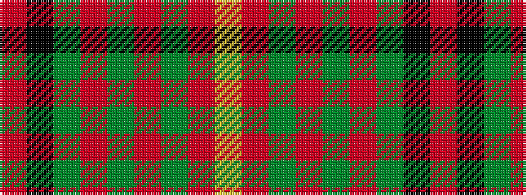

RKGRGRGRY

It is a 9 stripe tartan.

<figure class="pat-woven">

<figcaption>idealised sample</figcaption>
</figure>

## Colour Sequence



## Tartans with this colour sequence

| Tartans |
|---------------|
| [Fulton](/variants/s9/m4k2g17r6g6r6g15r20ly3~x2/)|
||
| [Fulton Family Tartan](/variants/s9/ri4k2g17r6g6r6g15r20lo3~x2/)|
||
