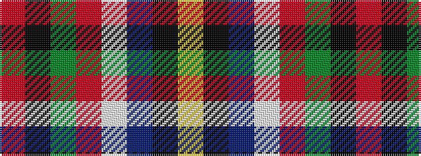

RKGRWBKY

It is a 8 stripe tartan.

<figure class="pat-woven">

<figcaption>idealised sample</figcaption>
</figure>

## Colour Sequence



## Tartans with this colour sequence

| Tartans |
|---------------|
| [M'Kleod](/variants/s8/o18k3g3r2w3db36k2ly6~x2/)|
||
