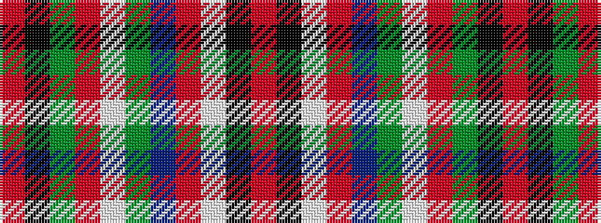

RKGRWGBRWKR

It is a 11 stripe tartan.

<figure class="pat-woven">

<figcaption>idealised sample</figcaption>
</figure>

## Colour Sequence



## Tartans with this colour sequence

| Tartans |
|---------------|
| [MacCullough Family Tartan Tartan Number: 3214. Earliest known date: 2000 I would like to let you know that working with Peter MacDonald, he designed a tartan for me that was registered with the Scottish Tartan Authority on 5 December 2000 See products available Copyright © Blair Urquhart, Comrie, 2015](/setts/s11/o5k3w2r20db10g2w1r1g20k4o3~x2/)|
||
