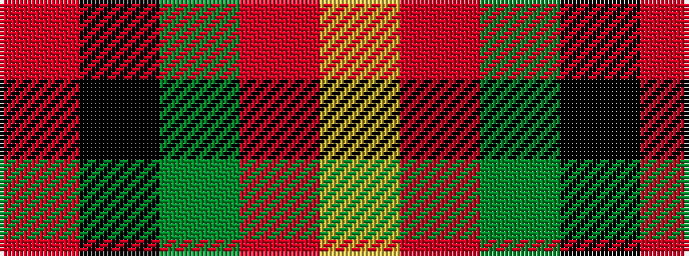

RKGRY

It is a 5 stripe tartan.

<figure class="pat-woven">

<figcaption>idealised sample</figcaption>
</figure>

## Colour Sequence



## Tartans with this colour sequence

| Tartans |
|---------------|
| [MacGleish Formal (Personal)](/setts/s5/o50k25dg10o5ly2~x2/)|
||
| [MacGleish Formal (Personal)](/setts/s5/r50k25g10o5ly2~x2/)|
||
