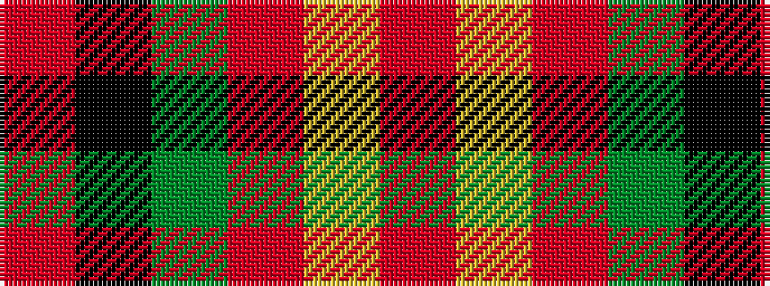

RKGRYR

It is a 6 stripe tartan.

<figure class="pat-woven">

<figcaption>idealised sample</figcaption>
</figure>

## Colour Sequence



## Tartans with this colour sequence

| Tartans |
|---------------|
| [Sturrock](/variants/s6/r52k32dg22r16ly3r16/)|
||
| [Sturrock](/variants/s6/r52k32g22r16ly3r16/)|
||
