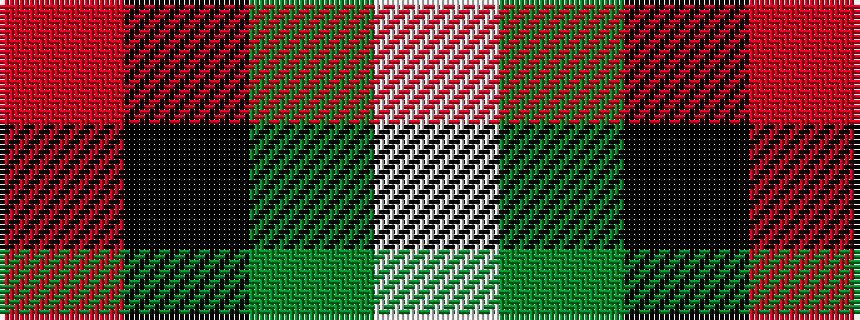

RKGW

It is a 4 stripe tartan.

<figure class="pat-woven">

<figcaption>idealised sample</figcaption>
</figure>

## Colour Sequence



## Tartans with this colour sequence

| Tartans |
|---------------|
| [Bacon, Red (Fashion)](/variants/s4/r14k3dg3w1~x2/)|
||
