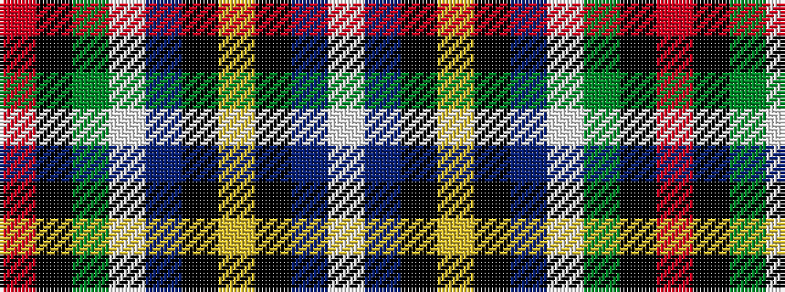

RKGWBKYKBW

It is a 10 stripe tartan.

<figure class="pat-woven">

<figcaption>idealised sample</figcaption>
</figure>

## Colour Sequence



## Tartans with this colour sequence

| Tartans |
|---------------|
| [Kirk in the Hills](/variants/s10/lb16db6k1ly1k1db1lb4dy4k1r1~x4/)|
||
