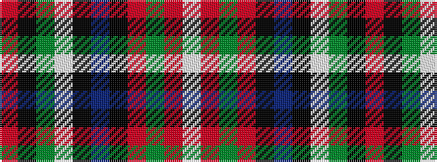

RKGWKBKRGRW

It is a 11 stripe tartan.

<figure class="pat-woven">

<figcaption>idealised sample</figcaption>
</figure>

## Colour Sequence



## Tartans with this colour sequence

| Tartans |
|---------------|
| [MacDonald, Sir John A](/setts/s11/r10k3dg2lb2k22db4k22r4dg4r14lb3~x2/)|
||
| [MacDonald, Sir John A.](/setts/s11/r12k4g2w2k21db3k22r4g4r15w3~x2/)|
||
| [York Region Pipe Band](/setts/s11/r10k3g2lb2k22db4k22r4g4r14lb3~x2/)|
||
