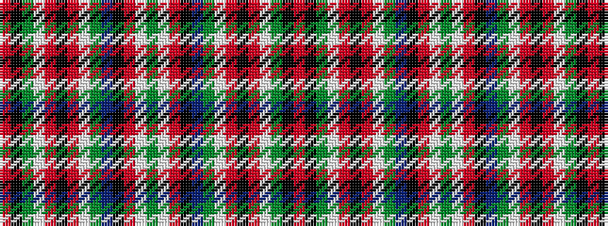

RKGWRKRWGBKRWGWRKBGWRKRWGKR

It is a 27 stripe tartan.

<figure class="pat-woven">

<figcaption>idealised sample</figcaption>
</figure>

## Colour Sequence



## Tartans with this colour sequence

| Tartans |
|---------------|
| [MacFarlane](/setts/s27/r42k1g12w2r3k1r3w2g2dp12k4r3w4g3w4r3k4dp12g2w2r3k1r3w2g12k1r21~x4/)|
||
