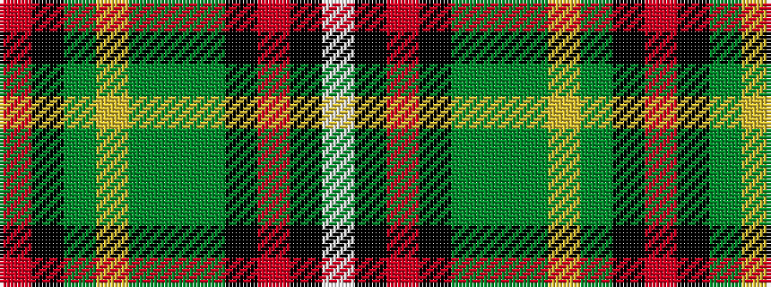

RKGYGGGKRKW

It is a 11 stripe tartan.

<figure class="pat-woven">

<figcaption>idealised sample</figcaption>
</figure>

## Colour Sequence



## Tartans with this colour sequence

| Tartans |
|---------------|
| [Bicknell, The Hamish (Personal)](/setts/s11/w3k1r25k2dy2g25dy2ly2dy10k1r2~x2/)|
||
