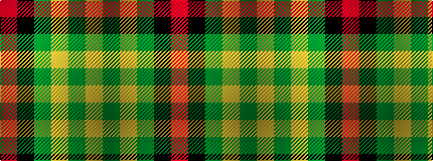

RKGYGY

It is a 6 stripe tartan.

<figure class="pat-woven">

<figcaption>idealised sample</figcaption>
</figure>

## Colour Sequence



## Tartans with this colour sequence

| Tartans |
|---------------|
| [Moore Caledonian (Personal)](/variants/s6/r1k6g6ly1g6ly1~x6/)|
||
