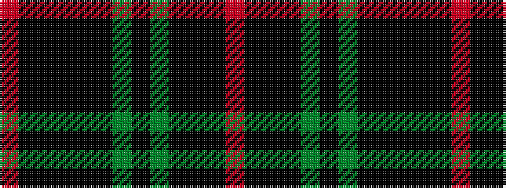

RKKKGKGKKKKKR

It is a 13 stripe tartan.

<figure class="pat-woven">

<figcaption>idealised sample</figcaption>
</figure>

## Colour Sequence



## Tartans with this colour sequence

| Tartans |
|---------------|
| [Metropolitan Atlanta Police](/setts/s13/r2k2k21k8dg16k3dg16k8k3k3k21k2r2~x2/)|
||
