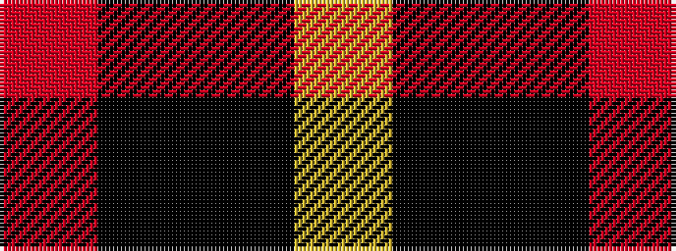

RKKY

It is a 4 stripe tartan.

<figure class="pat-woven">

<figcaption>idealised sample</figcaption>
</figure>

## Colour Sequence



## Tartans with this colour sequence

| Tartans |
|---------------|
| [McPeek (Fictitious clan)](/setts/s4/r63ki8k8ly5~x2/)|
||
