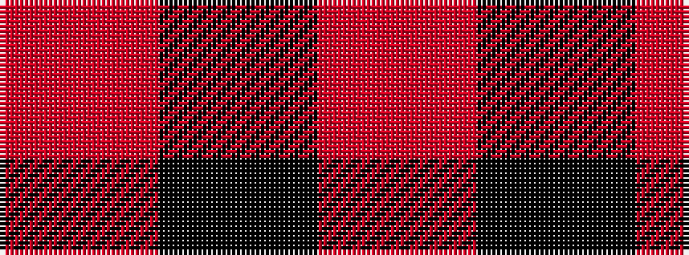

RKR

It is a 3 stripe tartan.

<figure class="pat-woven">

<figcaption>idealised sample</figcaption>
</figure>

## Colour Sequence



## Tartans with this colour sequence

| Tartans |
|---------------|
| [Buie](/variants/s3/m18k3m2~x4/)|
||
| [Buie](/variants/s3/r18k3r2~x4/)|
||
