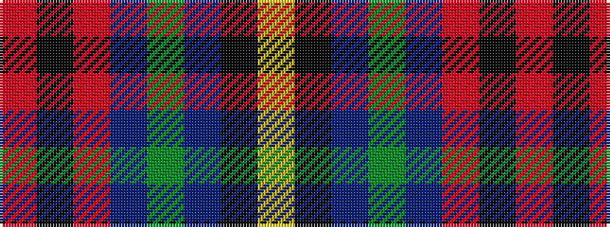

RKRBGBKY

It is a 8 stripe tartan.

<figure class="pat-woven">

<figcaption>idealised sample</figcaption>
</figure>

## Colour Sequence



## Tartans with this colour sequence

| Tartans |
|---------------|
| [Sandberg of Greenock (Personal)](/setts/s8/ly3k12db1g5db12r1k2r1~x4/)|
||
