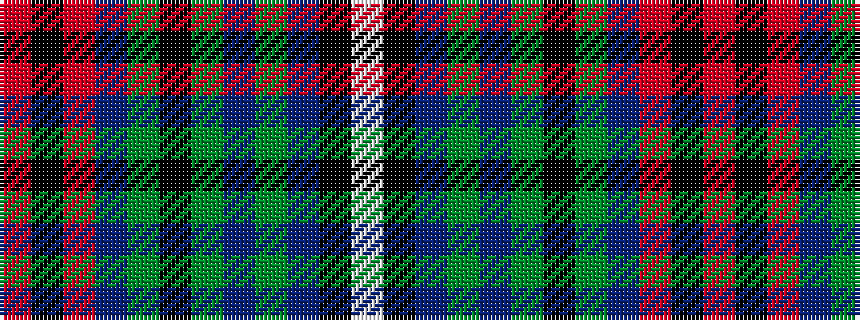

RKRBGKGBGBKW

It is a 12 stripe tartan.

<figure class="pat-woven">

<figcaption>idealised sample</figcaption>
</figure>

## Colour Sequence



## Tartans with this colour sequence

| Tartans |
|---------------|
| [Kelly of Sleat (Name)](/setts/s12/r4k4r28dp4g4k10g4dp4g4dp8k1w3~x2/)|
||
