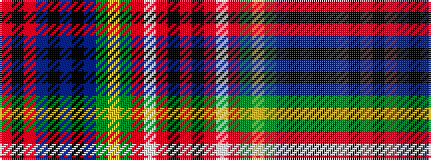

RKRBKBKBGYGRWRKR

It is a 16 stripe tartan.

<figure class="pat-woven">

<figcaption>idealised sample</figcaption>
</figure>

## Colour Sequence



## Tartans with this colour sequence

| Tartans |
|---------------|
| [Unidentified No 3](/variants/s16/r2k2r5t5k1t1k1t5dg6ly1dg6r6w1r1k1r1~x2/)|
||
| [Unnamed, No 3](/variants/s16/r2k2r5t5k1t1k1t5g6ly1g6r6w1r1k1r1~x2/)|
||
