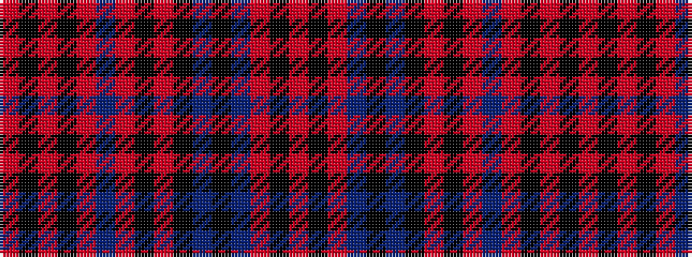

RKRBKBKRKRBRKRKR

It is a 16 stripe tartan.

<figure class="pat-woven">

<figcaption>idealised sample</figcaption>
</figure>

## Colour Sequence



## Tartans with this colour sequence

| Tartans |
|---------------|
| [(5) Ruxton hunting](/setts/s16/m16k1m8db2k1db16k3m1k1m15db4m2k3m1k1m16~x2/)|
||
