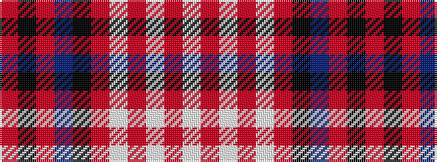

RKRBKRWRWRW

It is a 11 stripe tartan.

<figure class="pat-woven">

<figcaption>idealised sample</figcaption>
</figure>

## Colour Sequence



## Tartans with this colour sequence

| Tartans |
|---------------|
| [Logan #6](/variants/s11/r8k3o3dt28k20o28lb3o3lb3o3lb6/)|
||
