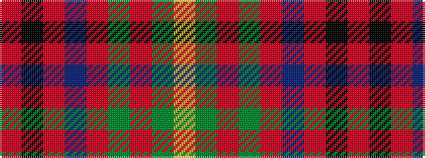

RKRBRGRGY

It is a 9 stripe tartan.

<figure class="pat-woven">

<figcaption>idealised sample</figcaption>
</figure>

## Colour Sequence



## Tartans with this colour sequence

| Tartans |
|---------------|
| [Oliver Dress (Red)](/variants/s9/r15k1r1n5r1g1r1g1lo1~x8/)|
||
| [Oliver, dress](/variants/s9/r40k3r2db12r2g2r2g2ly3~x2/)|
||
