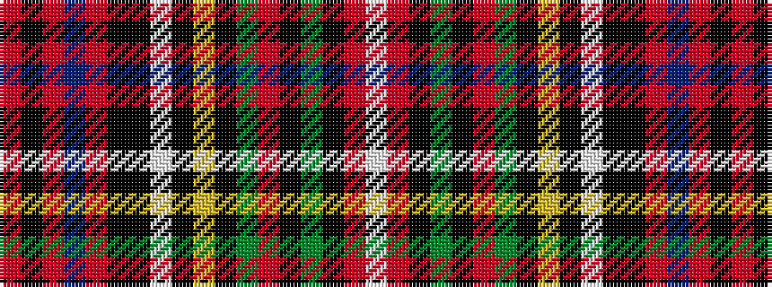

RKRBRKKWKYKGRKGKRW

It is a 18 stripe tartan.

<figure class="pat-woven">

<figcaption>idealised sample</figcaption>
</figure>

## Colour Sequence



## Tartans with this colour sequence

| Tartans |
|---------------|
| [Scotia Village (Corporate)](/variants/s18/r90k1r2db8r2k9k3w1k2ly1k3g13r11k1g2k1r5w2~x2/)|
||
