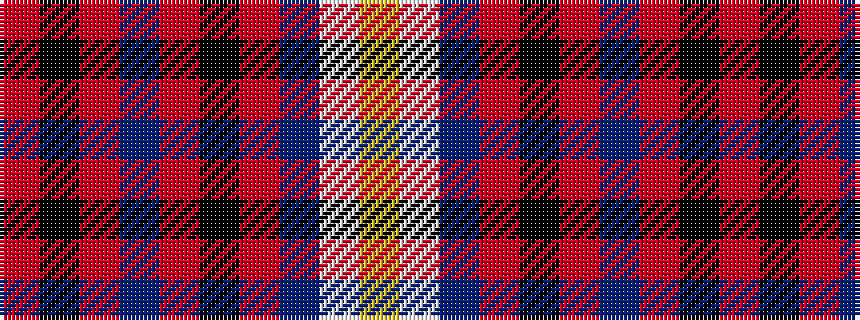

RKRBRKRBWY

It is a 10 stripe tartan.

<figure class="pat-woven">

<figcaption>idealised sample</figcaption>
</figure>

## Colour Sequence



## Tartans with this colour sequence

| Tartans |
|---------------|
| [Kyle, Pink (Dance)](/setts/s10/r17k1r2dpi2r2k1r3dp8w17ly2~x4/)|
||
