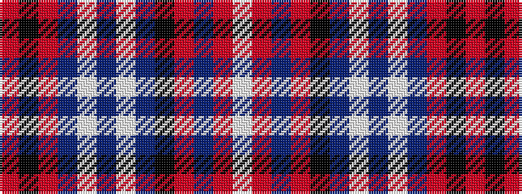

RKRBWBWBKRBRW

It is a 13 stripe tartan.

<figure class="pat-woven">

<figcaption>idealised sample</figcaption>
</figure>

## Colour Sequence



## Tartans with this colour sequence

| Tartans |
|---------------|
| [Leando (Coldingham) Hunting (Personal)](/variants/s13/o19k2r1do3w1do1w1do1k6o3do1o3w1~x4/)|
||
