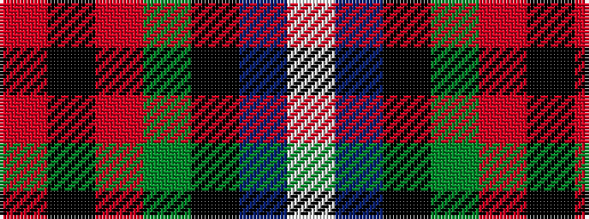

RKRGKBW

It is a 7 stripe tartan.

<figure class="pat-woven">

<figcaption>idealised sample</figcaption>
</figure>

## Colour Sequence



## Tartans with this colour sequence

| Tartans |
|---------------|
| [MacDuff Dress #5](/variants/s7/w39db9k10dg11r7k3r7~x2/)|
||
| [MacDuff dress](/variants/s7/w39db9k10g11r7k3r7~x2/)|
||
