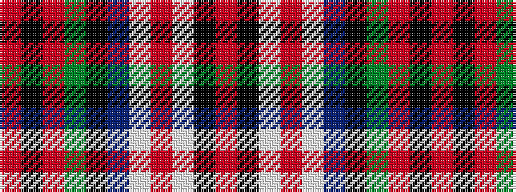

RKRGKBWRWKR

It is a 11 stripe tartan.

<figure class="pat-woven">

<figcaption>idealised sample</figcaption>
</figure>

## Colour Sequence



## Tartans with this colour sequence

| Tartans |
|---------------|
| [MacDuff Dress #4](/setts/s11/r16k6r14dg22k16db16w10r6w45k4r4/)|
||
| [MacDuff, dress](/setts/s11/r16k6r14g22k16db16w10r6w45k4r4/)|
||
