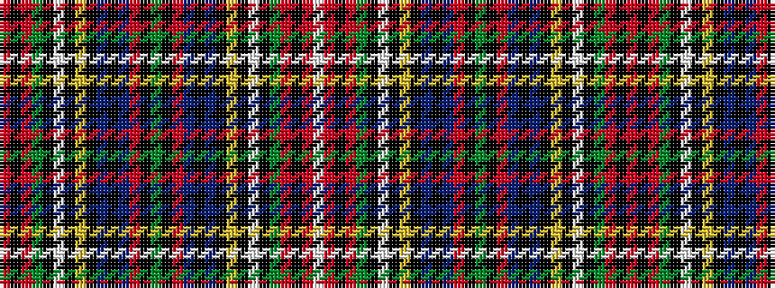

RKRGKWKYKBKBRKGKRBKBKYKWKGRKRW

It is a 30 stripe tartan.

<figure class="pat-woven">

<figcaption>idealised sample</figcaption>
</figure>

## Colour Sequence



## Tartans with this colour sequence

| Tartans |
|---------------|
| [Wilson's No.152](/setts/s30/r5k4r13g25k3w5k3ly3k16t9k2t9r12k2g3k2r12t9k2t9k16ly3k3w5k3g25r13k4r5w3~x2/)|
||
