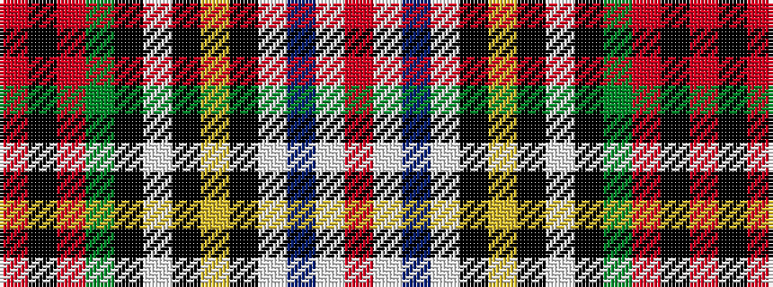

RKRGKWKYKWBWR

It is a 13 stripe tartan.

<figure class="pat-woven">

<figcaption>idealised sample</figcaption>
</figure>

## Colour Sequence



## Tartans with this colour sequence

| Tartans |
|---------------|
| [Victoria](/setts/s13/r6k2r12g10k3w2k3ly2k8w4db6w12r4/)|
||
| [Victoria (Patons)](/setts/s13/r6k2r12dg10k3w2k3ly2k8w4db6w12r4/)|
||
