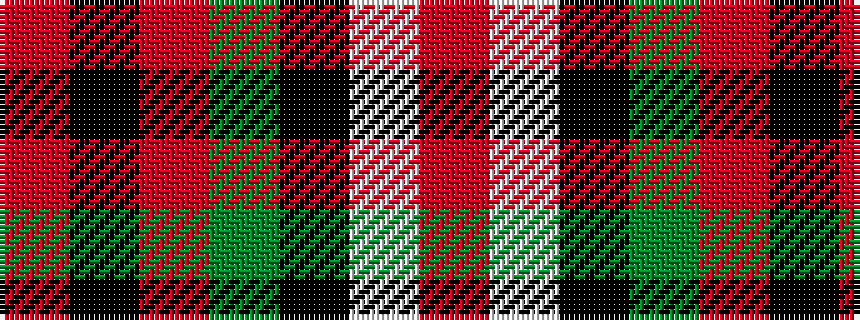

RKRGKWR

It is a 7 stripe tartan.

<figure class="pat-woven">

<figcaption>idealised sample</figcaption>
</figure>

## Colour Sequence



## Tartans with this colour sequence

| Tartans |
|---------------|
| [MacDuff #6](/variants/s7/r36lt9k12g17r10k3r10~x2/)|
||
