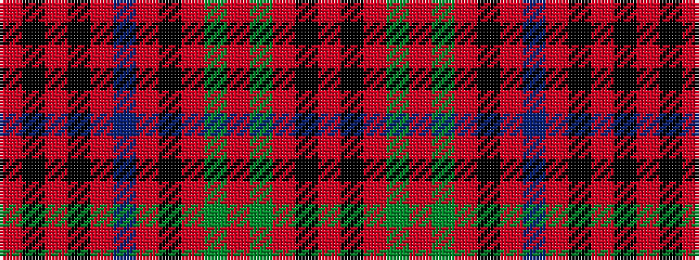

RKRGRGRKRBRKRKR

It is a 15 stripe tartan.

<figure class="pat-woven">

<figcaption>idealised sample</figcaption>
</figure>

## Colour Sequence



## Tartans with this colour sequence

| Tartans |
|---------------|
| [Grant](/setts/s15/r16k6r6dg46r6dg5r6k12r6t6r48k6r6k6r16/)|
||
| [Grant of Ballindalloch](/setts/s15/r5k5r3g16r3g3r3k10r3b5r12k5r3k3r5~x2/)|
||
| [Grant, Kilt](/setts/s15/r5k1r2k2r16t2r2k9r2g2r2g13r2k2r4~x2/)|
||
| [Unidentified No 3 #2](/setts/s15/r5k1r2k2r16t2r2k9r2dg2r2dg13r2k2r4~x2/)|
||
