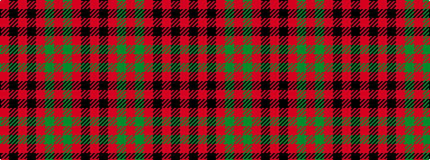

RKRGRGRKRKR

It is a 11 stripe tartan.

<figure class="pat-woven">

<figcaption>idealised sample</figcaption>
</figure>

## Colour Sequence



## Tartans with this colour sequence

| Tartans |
|---------------|
| [MacPherson-Grant](/variants/s11/r90k6r6k6r90g6r6g45r6k4r3/)|
||
