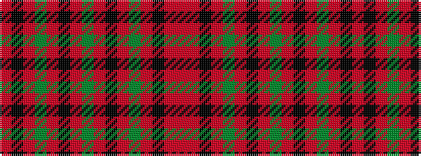

RKRGRKRGRKRGRKRR

It is a 16 stripe tartan.

<figure class="pat-woven">

<figcaption>idealised sample</figcaption>
</figure>

## Colour Sequence



## Tartans with this colour sequence

| Tartans |
|---------------|
| [Seaforth Estate Check](/variants/s16/r1o1k1o1y1o1k1o1y1~x12/)|
||
