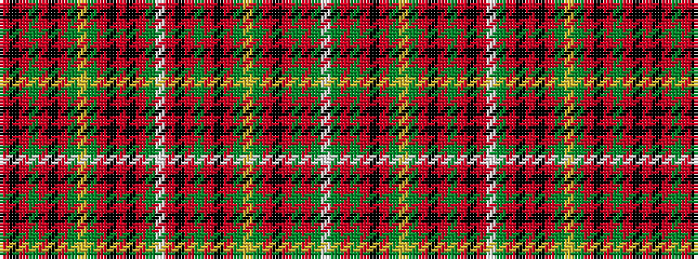

RKRGRKRGYGRKRKRGWRKRGRKRGYGRKRGRGW

It is a 34 stripe tartan.

<figure class="pat-woven">

<figcaption>idealised sample</figcaption>
</figure>

## Colour Sequence



## Tartans with this colour sequence

| Tartans |
|---------------|
| [Unidentified Scarlett #3](/setts/s34/r3k18r2g3r2k2r20g2ly1g2r2k18r2k2r20g3w1r3k18r2g3r2k2r20g2ly1g2r2k18r2g2r20g3w1~x2/)|
||
