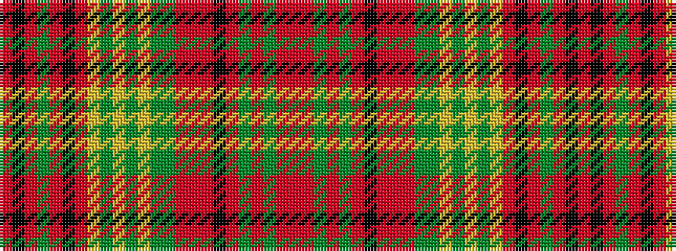

RKRGRKRYGYGYGGRRRKRGRGRR

It is a 24 stripe tartan.

<figure class="pat-woven">

<figcaption>idealised sample</figcaption>
</figure>

## Colour Sequence



## Tartans with this colour sequence

| Tartans |
|---------------|
| [McNair (2016)](/setts/s24/r2r1dg1r1g1r1k2r2r2r1dg2g1ly1g1ly1g1ly1r2k8r1g1r1k3r1~x10/)|
||
