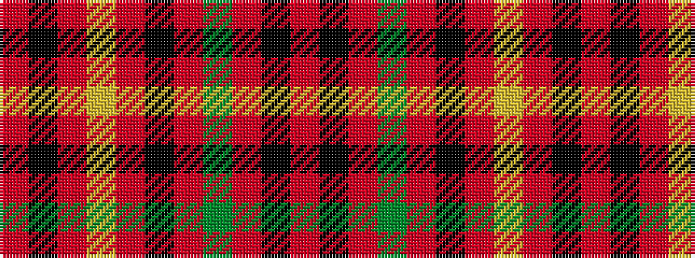

RKRGRKRYRKR

It is a 11 stripe tartan.

<figure class="pat-woven">

<figcaption>idealised sample</figcaption>
</figure>

## Colour Sequence



## Tartans with this colour sequence

| Tartans |
|---------------|
| [Taplin](/setts/s11/r52k2r5dg3r5k5r5ly3r5k2r52~x2/)|
||
| [Taplin (Name)](/setts/s11/r52k2r5g3r5k5r5ly3r5k2r52~x2/)|
||
