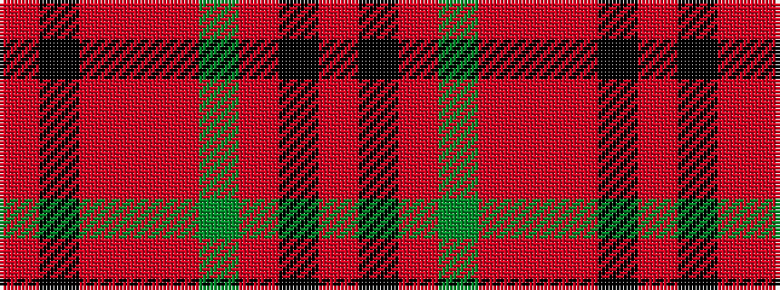

RKRGRRRKR

It is a 9 stripe tartan.

<figure class="pat-woven">

<figcaption>idealised sample</figcaption>
</figure>

## Colour Sequence



## Tartans with this colour sequence

| Tartans |
|---------------|
| [Fitzgibbon Red (Name)](/variants/s9/r2k1ri6r1ri2g2ri24k6ri2~x2/)|
||
