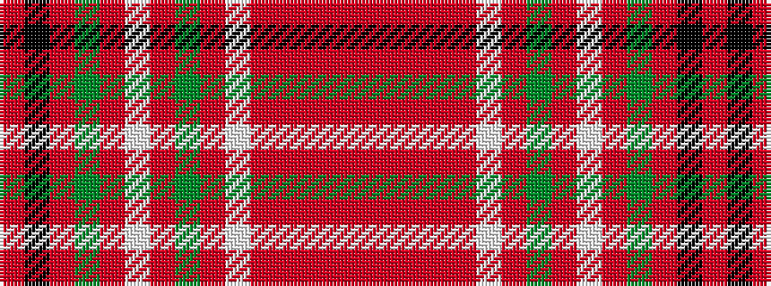

RKRGRWRGRWRRRRR

It is a 15 stripe tartan.

<figure class="pat-woven">

<figcaption>idealised sample</figcaption>
</figure>

## Colour Sequence



## Tartans with this colour sequence

| Tartans |
|---------------|
| [McCall (Name)](/variants/s15/r8k5r8g27r8w2r3g3r3w2r8o27r8o3r3~x2/)|
||
