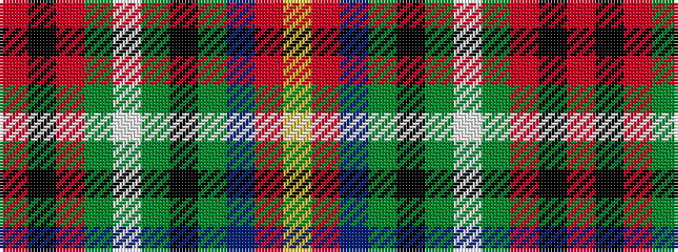

RKRGWGKGBRY

It is a 11 stripe tartan.

<figure class="pat-woven">

<figcaption>idealised sample</figcaption>
</figure>

## Colour Sequence



## Tartans with this colour sequence

| Tartans |
|---------------|
| [Norwell](/setts/s11/r4k4r32g4w3g4k13g3db18r2ly3~x2/)|
||
