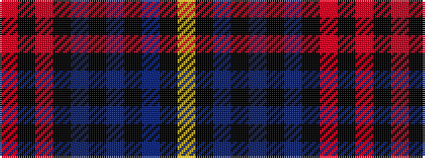

RKRKBKBKBKY

It is a 11 stripe tartan.

<figure class="pat-woven">

<figcaption>idealised sample</figcaption>
</figure>

## Colour Sequence



## Tartans with this colour sequence

| Tartans |
|---------------|
| [Brotherhood of Dirk, The](/setts/s11/r9k3r9k2n4k4dp4k3dp2k32lg6~x2/)|
||
