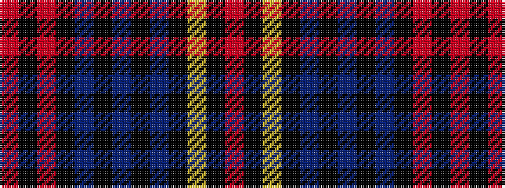

RKRKBKBKBKYKR

It is a 13 stripe tartan.

<figure class="pat-woven">

<figcaption>idealised sample</figcaption>
</figure>

## Colour Sequence



## Tartans with this colour sequence

| Tartans |
|---------------|
| [Edinburgh Castle (Corporate?)](/setts/s13/r2k4r2k22n1k3n1k3n1k22ly1k8r1~x2/)|
||
