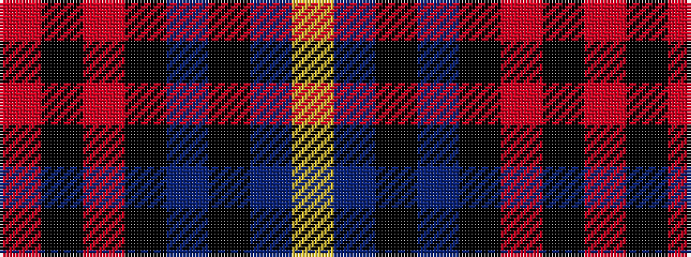

RKRKBKBY

It is a 8 stripe tartan.

<figure class="pat-woven">

<figcaption>idealised sample</figcaption>
</figure>

## Colour Sequence



## Tartans with this colour sequence

| Tartans |
|---------------|
| [Aitken](/variants/s8/lo5db2k2db12k16r20k2r4~x2/)|
||
