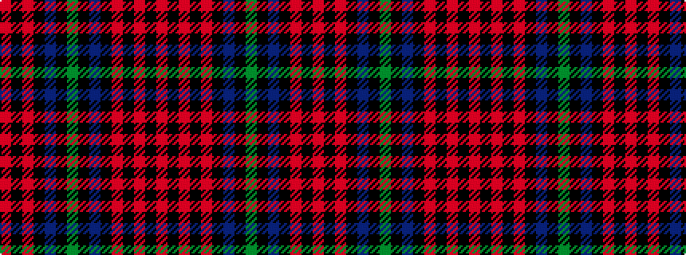

RKRKBKGKBKRKRKR

It is a 15 stripe tartan.

<figure class="pat-woven">

<figcaption>idealised sample</figcaption>
</figure>

## Colour Sequence



## Tartans with this colour sequence

| Tartans |
|---------------|
| [MacLachlan #3](/variants/s15/r12k2r2k2r2k10db10k1dg3k1db12k10r12k2r2~x2/)|
||
| [MacLachlan 1](/variants/s15/r12k2r2k2r2k10db10k1g3k1db12k10r12k2r2~x2/)|
||
