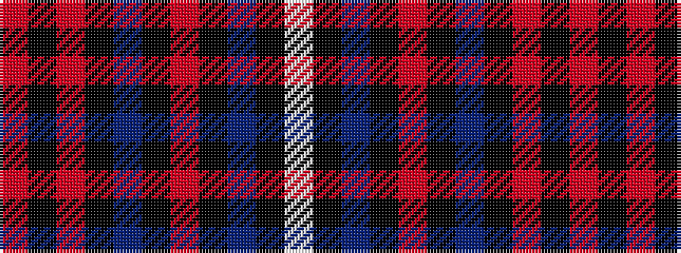

RKRKBKRKBKW

It is a 11 stripe tartan.

<figure class="pat-woven">

<figcaption>idealised sample</figcaption>
</figure>

## Colour Sequence



## Tartans with this colour sequence

| Tartans |
|---------------|
| [American Heritage](/setts/s11/w5k2db14k4r8k4db4k80r6k4r4/)|
||
