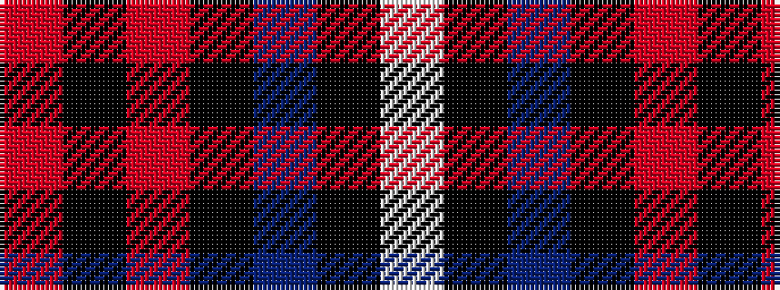

RKRKBKW

It is a 7 stripe tartan.

<figure class="pat-woven">

<figcaption>idealised sample</figcaption>
</figure>

## Colour Sequence



## Tartans with this colour sequence

| Tartans |
|---------------|
| [MacKean (Personal)](/variants/s7/r8k18r6k18b27k2w3~x2/)|
||
| [MacKean Red](/variants/s7/r4k8r4k8db12k1w2~x2/)|
||
