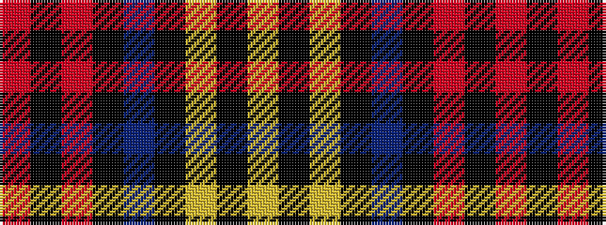

RKRKBKYKY

It is a 9 stripe tartan.

<figure class="pat-woven">

<figcaption>idealised sample</figcaption>
</figure>

## Colour Sequence



## Tartans with this colour sequence

| Tartans |
|---------------|
| [Scotsburn Croft](/variants/s9/lg16k3lg16k26dp4k26o20k3o8/)|
||
