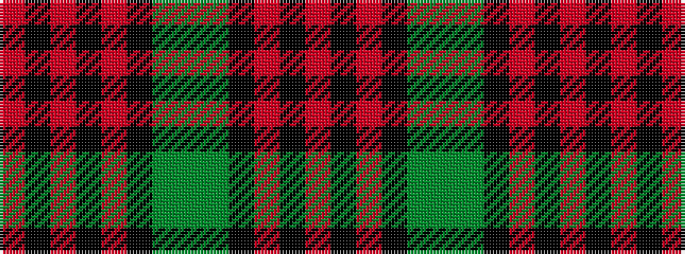

RKRKGGGKRKRKR

It is a 13 stripe tartan.

<figure class="pat-woven">

<figcaption>idealised sample</figcaption>
</figure>

## Colour Sequence



## Tartans with this colour sequence

| Tartans |
|---------------|
| [Red Watch (Fashion) #3](/setts/s13/o26k2o3k2o3k16y18y4y18k16o18k2o3~x2/)|
||
