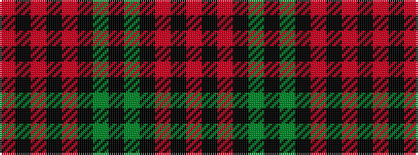

RKRKGKGKRKRKR

It is a 13 stripe tartan.

<figure class="pat-woven">

<figcaption>idealised sample</figcaption>
</figure>

## Colour Sequence



## Tartans with this colour sequence

| Tartans |
|---------------|
| [Brown, Watch](/setts/s13/o11k1o1k1o1k8g8k1g8k8o8k1o1~x2/)|
||
