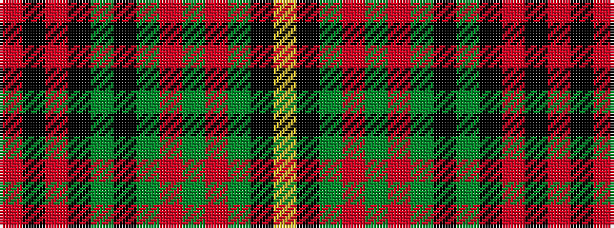

RKRKGKGRGRGKY

It is a 13 stripe tartan.

<figure class="pat-woven">

<figcaption>idealised sample</figcaption>
</figure>

## Colour Sequence



## Tartans with this colour sequence

| Tartans |
|---------------|
| [Melrose (District)](/variants/s13/r64k2r2k6g2k2g2o2g6r5g2k6ly2~x2/)|
||
