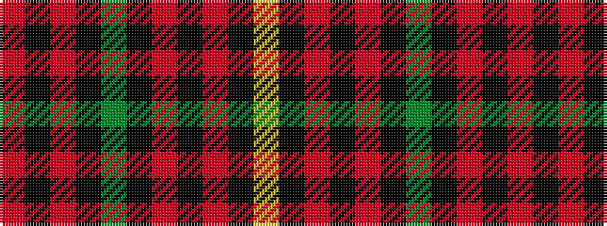

RKRKGKRKRKY

It is a 11 stripe tartan.

<figure class="pat-woven">

<figcaption>idealised sample</figcaption>
</figure>

## Colour Sequence



## Tartans with this colour sequence

| Tartans |
|---------------|
| [Canterbury (Fashion)](/variants/s11/r2k20r5k4dg4k4r5k2r14k2lo2~x2/)|
||
