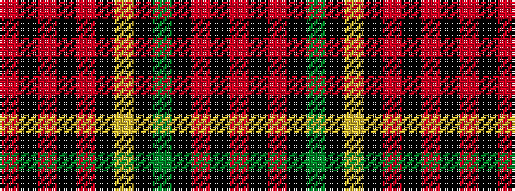

RKRKGKYKRKRKR

It is a 13 stripe tartan.

<figure class="pat-woven">

<figcaption>idealised sample</figcaption>
</figure>

## Colour Sequence



## Tartans with this colour sequence

| Tartans |
|---------------|
| [Firefighters' Memorial](/setts/s13/r4k2r3k35g7k2lo2k35ri6k8ri65k4ri4/)|
||
