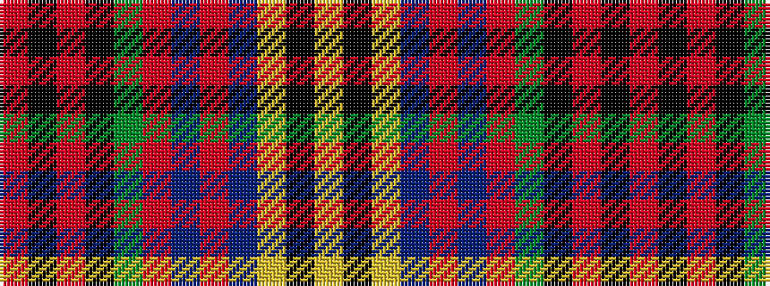

RKRKGRBRBYKY

It is a 12 stripe tartan.

<figure class="pat-woven">

<figcaption>idealised sample</figcaption>
</figure>

## Colour Sequence



## Tartans with this colour sequence

| Tartans |
|---------------|
| [Celts, Tartan of the](/setts/s12/r2k1r1k1g15r4db4r3db3ly1k1ly2~x6/)|
||
